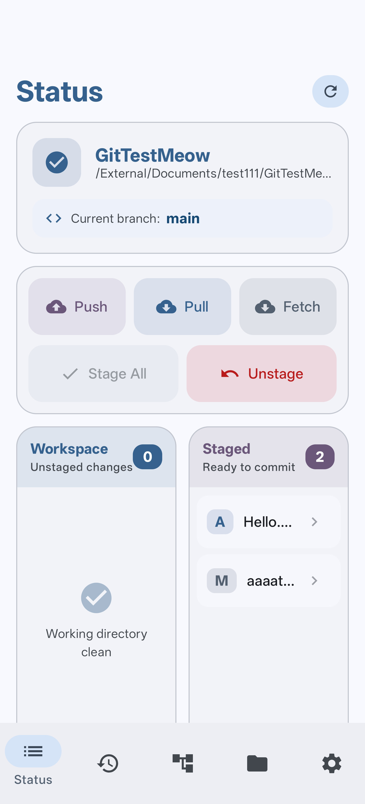
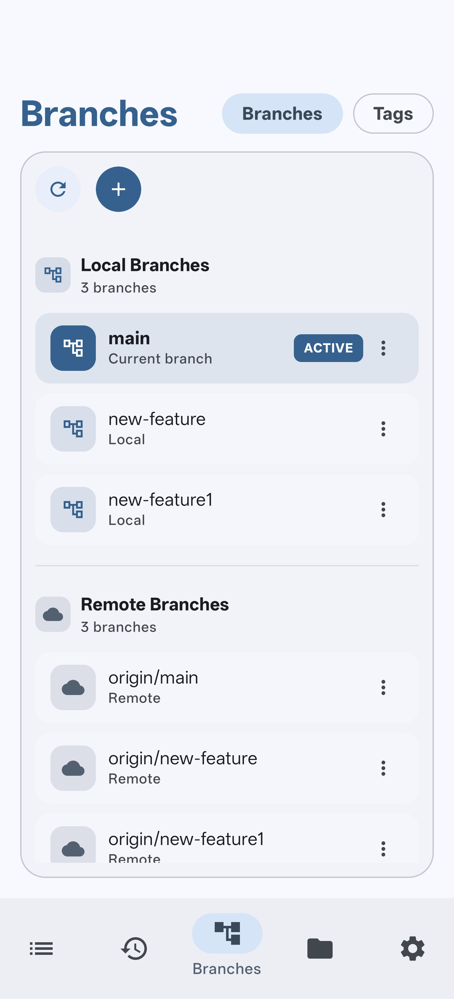
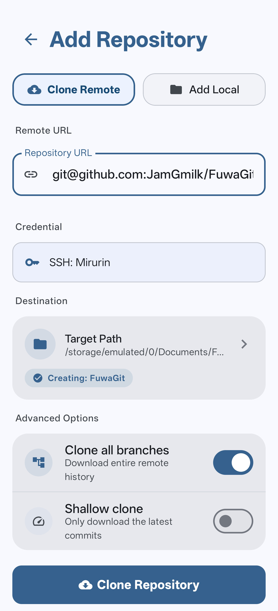

**English** | [简体中文](README.zh-Hans.md)

# FuwaGit

FuwaGit is a lightweight and powerful Git client for Android. Built with modern technologies like Jetpack Compose and Material Design 3, it offers a beautiful interface for developers on the go.

*Fuwa (ふわ): light and airy~*

---

## Screenshots

|                                                        |                                                        |                                                        |
|:------------------------------------------------------:|:------------------------------------------------------:|:------------------------------------------------------:|
|  |  |  |

## Download

Grab the latest APK from the [Releases](https://github.com/JamGmilk/FuwaGit/releases/latest) page.

## Tech Stack

| Component         | Technology        |
|:------------------|:------------------|
| **Language**      | Kotlin            |
| **UI Framework**  | Jetpack Compose   |
| **Design System** | Material Design 3 |
| **Git Library**   | Eclipse JGit      |
| **SSH**           | JSch              |
| **DI**            | Hilt              |
| **Min SDK**       | 26 (Android 8.0)  |

## Features

### Git Operations
- **Full Lifecycle**: Clone (HTTPS/SSH), Commit, Push, Pull, and Fetch.
- **Branching**: Create, delete, rename, and checkout branches easily.
- **Advanced**: Merge with conflict detection, interactive rebase, and tags support.
- **Resets**: Support for Soft, Mixed, and Hard resets.
- **Diff View**: Built-in syntax highlighting for viewing changes.

### Security & UX
- **Biometric Lock**: Protect your Git credentials with fingerprint/face unlock.
- **AES-256 Encryption**: Secure storage backed by the Android Keystore.
- **SSH Key Gen**: Generate Ed25519 or RSA keys directly in the app.
- **Dynamic Theming**: Full support for Material You and Dark Mode.

## License
    Copyright 2026 JamGmilk
    MIT License
